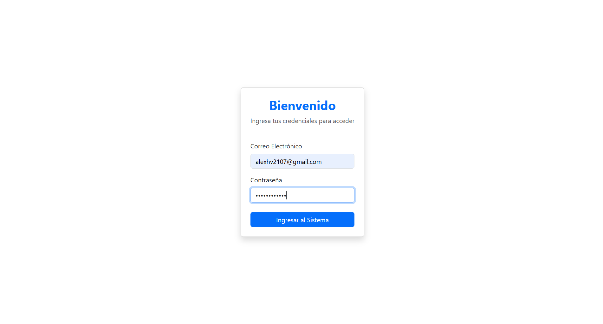
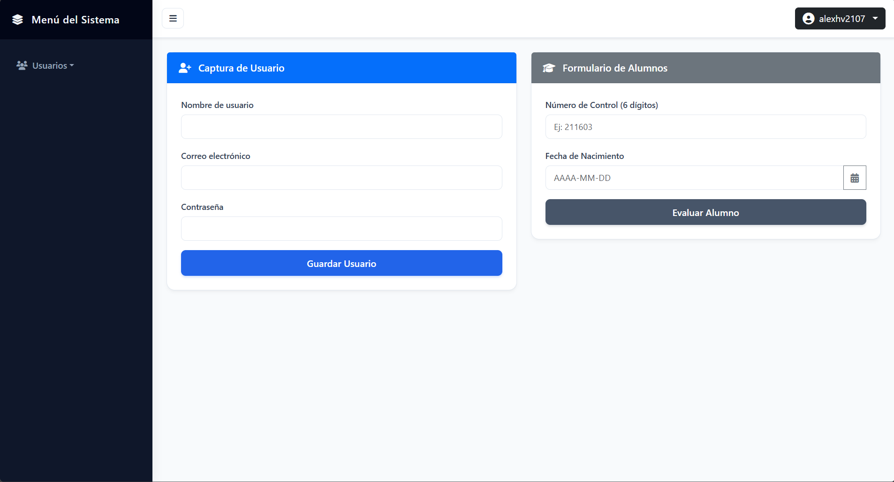
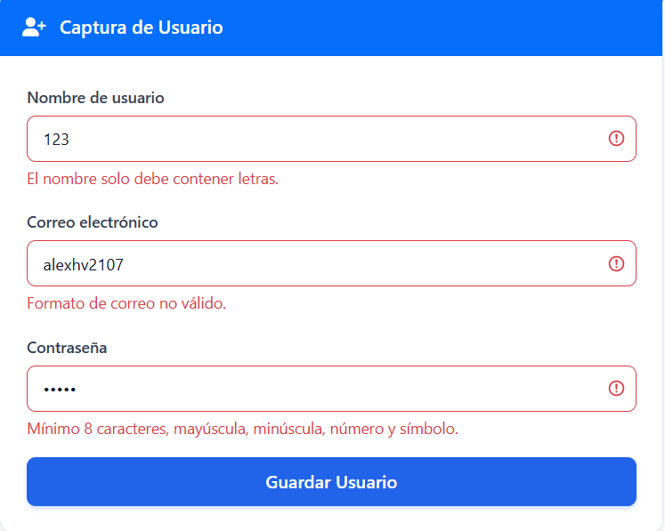
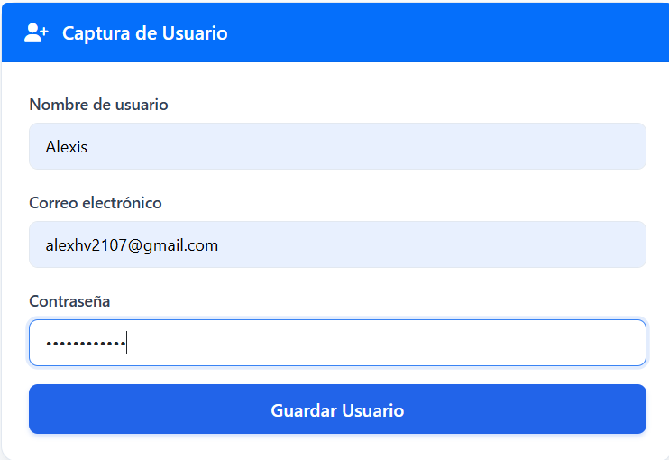
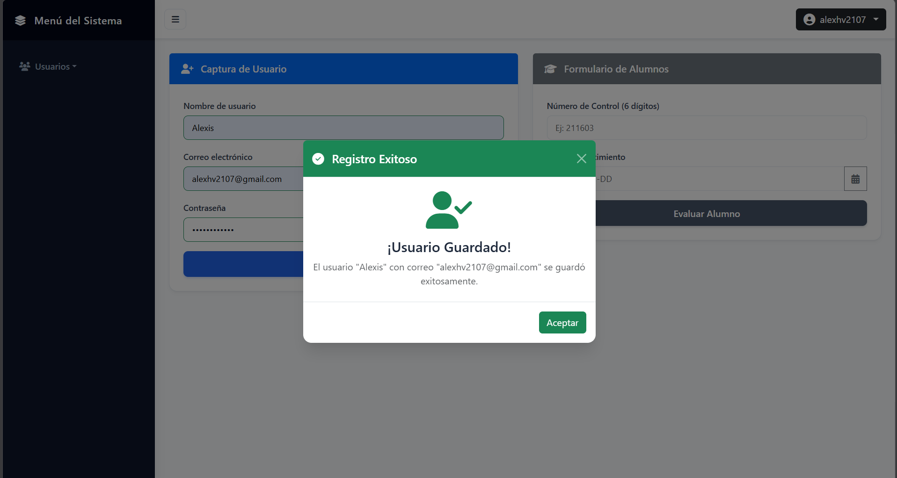
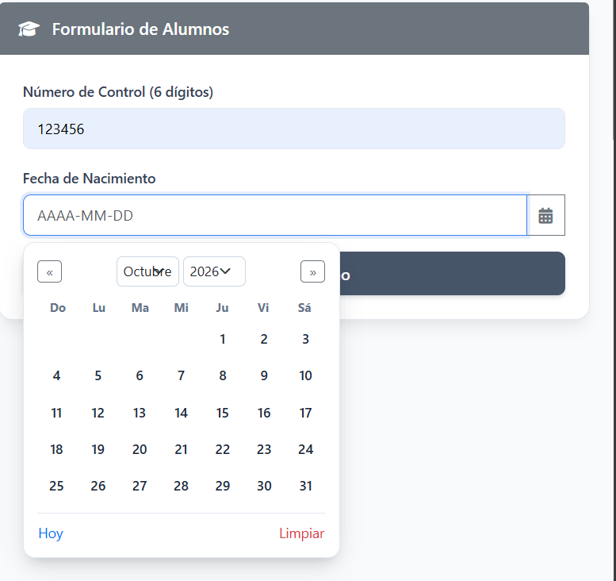
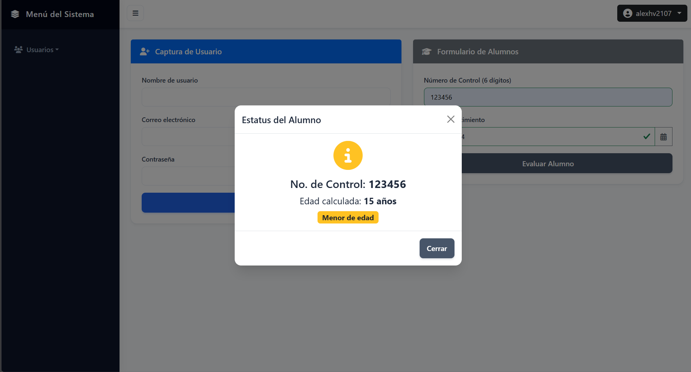
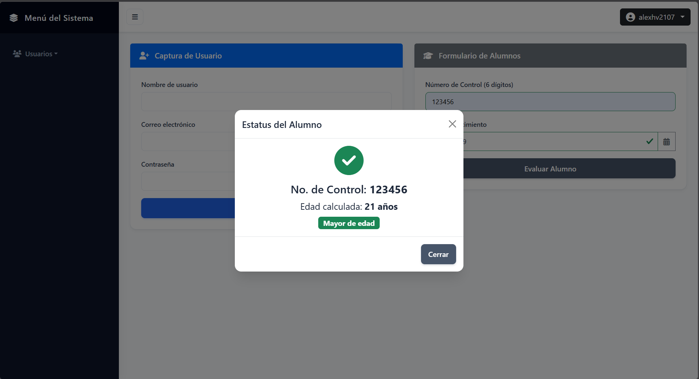

# Actividad 5: Proyecto de Login y Panel Administrativo

*Integrantes del Equipo (Participación 50/50):*
* **Aleks Jesús Aquino Rosales** (Lógica de Autenticación, Navbar y Configuración)
* **Alexis Hernández Vázquez** (Estructura Base, Sidebar, DatePicker, Formularios y Modales)

*Materia:* Programación Web  
*Institución:* Instituto Tecnológico de Oaxaca (ITO)  

---

##  Enlaces del Proyecto
* **Repositorio en GitHub:** [https://github.com/aleksardio/Actividad5-Login](https://github.com/aleksardio/Actividad5-Login)
* **Demostración en Vivo (GitHub Pages):** [https://aleksardio.github.io/Actividad5-Login/login.html](https://aleksardio.github.io/Actividad5-Login/login.html)

---

##  Descripción del Proyecto
Sistema web interactivo dividido en dos pantallas conectadas (`login.html` e `index.html`) que simulan el flujo de autenticación, control de sesión de usuario y un panel administrativo escolar.

El proyecto fue desarrollado utilizando **HTML5, CSS3 personalizado, JavaScript Vanilla y Bootstrap 5** (elegido como framework base para estructurar con agilidad componentes responsivos como el Navbar interactivo, el menú desplegable, el Sidebar y las ventanas modales sin dependencias de frameworks de JavaScript complejos).

---

##  Explicación del Flujo y Documentación Técnica

### 1. Flujo de Autenticación (`login.html` → `index.html`)
El formulario de acceso intercepta el evento `submit` evitando la recarga automática mediante `e.preventDefault()`. Antes de permitir el acceso, se validan los campos con la librería modular `utileria.js`:
* `validarCorreo()`: Comprueba el formato adecuado de correo mediante expresiones regulares.
* `validarPassword()`: Exige un mínimo de 8 caracteres, mayúscula, minúscula, número y símbolo especial.

### 2. Persistencia de Sesión y Navbar Dinámico
Para comunicar el usuario logueado entre ambas páginas sin un backend real:
* **En el Login:** Al validarse las credenciales, se almacena el correo en el navegador mediante `localStorage.setItem('usuarioSesion', correo)` y se redirige con `window.location.href = 'index.html'`.
* **Protección de Ruta:** En `main.js`, al cargar `index.html`, se comprueba la existencia de `usuarioSesion`. Si no existe, se expulsa inmediatamente a `login.html`.
* **Renderizado:** Se extrae el nombre corto previo al `@` y se renderiza un dropdown dinámico con avatar en la cabecera derecha.
* **Cierre de Sesión:** La opción "Salir del sistema" invoca `localStorage.removeItem('usuarioSesion')` y devuelve al usuario a `login.html`.

### 3. Métodos Centralizados en `utileria.js`
* `soloLetras(texto)`: Comprueba que el nombre solo contenga caracteres alfabéticos y espacios.
* `validarCorreo(correo)`: Evalúa la sintaxis estándar de correos electrónicos.
* `validarPassword(pass)`: Valida la complejidad requerida de la contraseña.
* `validarLongitud(texto, 6)`: Asegura que el número de control conste estrictamente de 6 dígitos numéricos.
* `calcularEdad(fecha)`: Determina la edad cronológica exacta a partir de la fecha de nacimiento ingresada.
* `esMayorDeEdad(fecha)`: Retorna un valor booleano evaluando si la persona tiene 18 años o más.

---

##  Proceso de Creación Paso a Paso

### Fase 1: Arquitectura y Autenticación (Aleks)

1. **Configuración del Repositorio:** Inicialización en GitHub con ramas base y organización modular de directorios (`css/`, `js/`, `img/`).
2. **Interfaz de Acceso (`login.html`):** Maquetación de la tarjeta centralizada con Bootstrap 5 y estilos en `css/login.css`.
3. **Manejo de Sesión (`js/login.js`):** Intercepción del envío del formulario, validación de credenciales contra `utileria.js` y almacenamiento en el navegador:

```javascript
loginForm.addEventListener('submit', (e) => {
  e.preventDefault();
  if (!utileria.validarCorreo(correo) || !utileria.validarPassword(password)) return;
  localStorage.setItem('usuarioSesion', correo);
  window.location.href = 'index.html';
});
```

---

### Fase 2: Panel Administrativo, Componentes y Modales (Alexis)

1. **Sidebar y Layout Colapsable:** Maquetación con CSS Flexbox y lógica en JavaScript para alternar la clase `.active` mediante el botón hamburguesa:

```javascript
sidebarBtn.addEventListener('click', () => {
  sidebar.classList.toggle('active');
});
```

2. **Componente DatePicker Personalizado:** Desarrollo de una clase modular en JS que calcula días del mes y controla la selección en un calendario flotante:

```javascript
selectDate(year, month, day) {
  this.selectedDate = new Date(year, month, day);
  this.input.value = `${year}-${String(month + 1).padStart(2, '0')}-${String(day).padStart(2, '0')}`;
  this.dropdown.classList.remove('active');
}
```

3. **Formularios con Validación de utileria.js y Disparo de Modales:** Validación del formato de control (6 dígitos) y determinación de mayoría de edad:

```javascript
const esControlValido = /^\d+$/.test(numCtrl) && validarLongitud(numCtrl, 6);
if (esControlValido && fechaNac) {
  const esMayor = esMayorDeEdad(fechaNac);
  modalEdad.show();
}
```

4. **Limpieza Automática al Cerrar Modales:** Uso del evento nativo de Bootstrap `hidden.bs.modal` para vaciar los campos y remover las clases de validación (`is-valid` / `is-invalid`):

```javascript
modalUsuarioElem.addEventListener('hidden.bs.modal', () => {
  formUsuario.reset();
  formUsuario.querySelectorAll('.form-control').forEach(input => {
    input.classList.remove('is-valid', 'is-invalid');
  });
});
```

---

### Fase 3: Integración y Verificación de Commits

1. **Protección de Rutas y Navbar:** Verificación de sesión activa y carga dinámica del usuario en la barra superior:

```javascript
const sesion = localStorage.getItem('usuarioSesion');
if (!sesion) {
  window.location.href = 'login.html';
} else {
  document.getElementById('navUserSpan').textContent = sesion.split('@')[0];
}
```

2. **Historial de Commits Equitativo:** Sincronización continua con Git para mantener el balance 50/50 estipulado en la rúbrica de evaluación.

---

## Capturas del Flujo Completo

### 1. Pantalla de Acceso (Login)


### 2. Panel Principal y Navbar con Usuario Activo


### 3. Captura de usuario con errores


### 4. Captura de usuario con datos correctos


### 5. Modal de Usuario Registrado Exitosamente


### 6. Selector de Fechas (DatePicker) en Acción


### 7. Modal de Menoría de Edad


### 8. Modal de Mayoría de Edad


